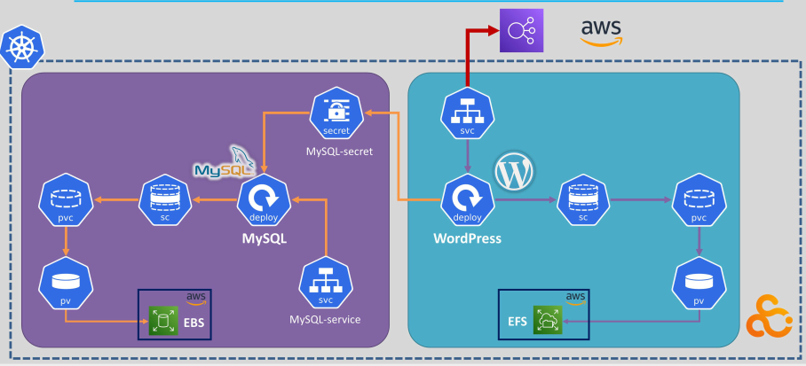

# 📦 WordPress + MySQL on Kubernetes (Self-Managed on AWS)

This project demonstrates deploying a **WordPress** application with a **MySQL** database on a self-managed **Kubernetes cluster** running on **AWS infrastructure**. The architecture includes **Persistent Volumes** backed by AWS **EBS** and **EFS**, and uses Kubernetes **Secrets**, **PVCs**, and **Services** to manage connectivity and storage.

---

## 🗺️ Architecture Overview

The deployment is divided into two main components:

### 🔹 MySQL Section (Purple Zone)
- A **PersistentVolumeClaim (PVC)** is bound to a **PersistentVolume (PV)**.
- The PV is backed by an AWS **EBS** volume, provisioned using a **StorageClass (SC)**.
- A **MySQL Deployment** mounts the volume and uses a **Kubernetes Secret** (`MySQL-secret`) for secure configuration.
- A **ClusterIP Service** (`MySQL-svc`) exposes the MySQL Pod internally for access by WordPress.

### 🔹 WordPress Section (Teal Zone)
- A **WordPress Deployment** connects to a **PersistentVolume (PV)** backed by **AWS EFS** via a **StorageClass**.
- The Deployment mounts the volume using a **PVC**.
- A **Service** exposes the WordPress application, typically via LoadBalancer or NodePort.
- The WordPress pod is configured to connect to the MySQL database via internal DNS (`MySQL-svc`).

---

## 📁 Project Structure

```bash
wordpress-k8s-aws/
│
├── manifests/                    # Kubernetes YAML files
│   ├── mysql-deployment.yaml
│   ├── mysql-service.yaml
│   ├── wordpress-deployment.yaml
│   ├── wordpress-service.yaml
│   ├── storage-class.yaml
│   └── persistent-volume.yaml
│
├── scripts/                      # Utility scripts
│   ├── deploy.sh                 # Apply all manifests
│   └── cleanup.sh                # Delete all resources
│
├── images/
│   └── architecture-diagram.png





│
└── README.md
